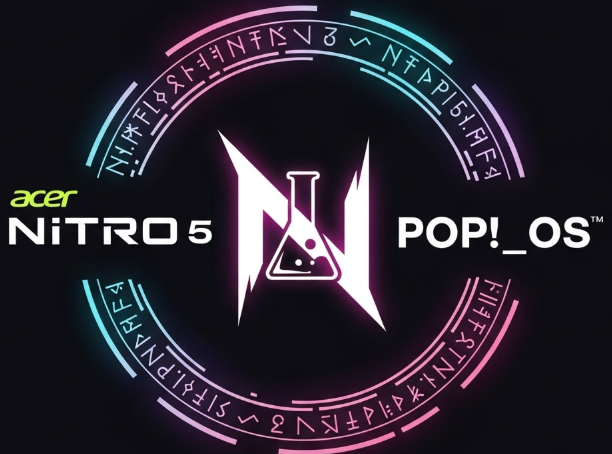

  <h1 style="font-size: 2em;">Pop-OS-Nitro-5-Linux-Utilitarios</h1>
    
  

 
Fui juntando aqui uns scripts `.sh` que criei ou adaptei pra resolver umas dores de cabeça no Pop!_OS (qualquer outra distro linux passou pelo), principalmente as que tive com meu Acer Nitro 5.

Estou deixando tudo aqui porque, honestamente, não achei solução pra várias dessas coisas no GitHub e, se isso poupar algumas horas de raiva de alguém, já valeu a pena. Use como quiser.

---

### Os Scripts (A caixa de ferramentas)
> ### `reparo_completo_sistema.sh`
Link: [src/reparo_completo_sistema.sh](src/reparo_completo_sistema.sh)

> Esse aqui é o meu "botão nuclear", o último recurso antes de jogar tudo pro alto e formatar. É um script meio bruto que tenta de tudo um pouco: limpa o sistema, reinstala um monte de coisa essencial, mexe nos drivers..., o famoso "reza e vai". Use por sua conta e risco, mas já me salvou uma vez(acho).

> ### `aplicador_solucoes_nitro5.sh`
Link: [src/aplicador_solucoes_nitro5.sh](src/aplicador_solucoes_nitro5.sh)

> Esse virou meu "kit de sobrevivência" pro Nitro 5. Juntei nele um monte de correção que precisei fazer: o ajuste do brilho, a gambiarra pra USB não morrer do nada, o jeito de criar a entrada de boot do Windows... Até a configuração pra fazer o Spicetify funcionar direito tá aí. Basicamente, a paz que a Acer não me deu.

> ### `restaurador_audio_pipewire.sh`
Link: [src/restaurador_audio_pipewire.sh](src/restaurador_audio_pipewire.sh)

> Meu microfone de repente começou a soar como se eu estivesse falando de dentro de uma garrafa, com um eco bizarro e captando até a ventoinha do notebook. Esse script foi o que resolveu. Ele basicamente reseta as configurações do PipeWire e reinstala as coisas no lugar. Foi o que exorcizou os espectros ectoplásmicos do meu áudio.

> ### `arquiteto_de_diretorios.sh`
Link: [src/arquiteto_de_diretorios.sh](src/arquiteto_de_diretorios.sh)

> Minha pasta de "Downloads" era uma zona de guerra. Criei esse "arquiteto" pra dar um jeito na bagunça. É um assistente com menu que te ajuda a organizar as coisas, e o melhor é que ele pode só "simular" primeiro, te mostrando o que faria, sem mover nada. Fiz ele ser à prova de gente apressada (eu).

> ### `coletor_geral_logs.sh`
Link: [src/coletor_geral_logs.sh](src/coletor_geral_logs.sh)

> Usei esse quando precisei pedir ajuda num fórum gringo e me pediram "os logs". Em vez de ficar caçando, esse script funciona como uma ressonância magnética: coleta uma quantidade absurda de logs do sistema e joga tudo numa pasta. Daí é só compactar e mandar pra quem manja.

> ### `diagnostico_focado_erros.sh`
Link: [src/diagnostico_focado_erros.sh](src/diagnostico_focado_erros.sh)

> Diferente do de cima, que pega tudo, este aqui é o "termômetro". Ele só busca os problemas óbvios e os erros mais comuns nos logs. É bom pra ter uma noção rápida do tamanho do estrago sem precisar ler um livro de logs.

> ### `gerador_inventario_software.sh`
Link: [src/gerador_inventario_software.sh](src/gerador_inventario_software.sh)

> Eu honestamente não lembrava nem metade das coisas que tinha instalado, especialmente AppImages e uns trecos que compilei na mão anos atrás. Por isso fiz o "Inquisidor". Ele só... uh... vasculha tudo e lista o que encontra, dos pacotes normais até esses fantasmas esquecidos no HD.

> ### `verificador_integridade_pre-boot.sh`
Link: [src/verificador_integridade_pre-boot.sh](src/verificador_integridade_pre-boot.sh)

> Sabe aquele suor frio que desce depois de mexer num arquivo de configuração importante e ter que reiniciar? Criei esse "amuleto" pra esses momentos. Ele só dá uma checada geral nas coisas vitais do boot pra ver se a chance de dar BO é grande ou pequena.

> ### `backup_particao_efi.sh`
Link: [src/backup_particao_efi.sh](src/backup_particao_efi.sh)

> A partição EFI é o que deixa seu computador ligar, basicamente. Se ela corromper, já era. Esse script é só uma apólice de seguro que faz um backup dela. Tomara que você nunca precise restaurar, mas é bom ter.

> ### `exportador_lista_pacotes.sh`
Link: [src/exportador_lista_pacotes.sh](src/exportador_lista_pacotes.sh)

> Pra quando eu decido formatar ou quero montar um sistema parecido em outra máquina. Ele basicamente cria uma "lista de compras" de tudo que tá instalado via APT, Flatpak e Snap, pra facilitar a vida depois.

> ### `removedor_seguro_diretorio.sh`
Link: [src/removedor_seguro_diretorio.sh](src/removedor_seguro_diretorio.sh)

> Fiz esse mais como um modelo, praquele momento de "posso apagar isso... eu acho". Em vez de dar um `rm -rf` e chorar depois, ele usa o `gio trash`, que manda as coisas pra lixeira normal do sistema. Limpeza com botão de "desfazer".

> ### `unificador_temas_dracula.sh`
Link: [src/unificador_temas_dracula.sh](src/unificador_temas_dracula.sh)

> Eu ficava maluco quando instalava um tema legal e os aplicativos em Flatpak continuavam com a cara do Windows 95. Esse script força todo mundo a usar o mesmo tema GTK, de ícones e de cursor. Sem mais apps rebeldes.

> ### `instalador_extensoes_gnome.sh`
Link: [src/instalador_extensoes_gnome.sh](src/instalador_extensoes_gnome.sh)

> Preguiça de ficar caçando e instalando extensão do GNOME uma por uma. Joguei os IDs das que eu mais uso aqui e ele instala tudo de uma vez.

> ### `ajuste_backlight_acpi.sh`
Link: [src/ajuste_backlight_acpi.sh](src/ajuste_backlight_acpi.sh)

> O controle de brilho do meu notebook simplesmente parou de funcionar. Depois de muito procurar, descobri que forçar o modo "native" do ACPI resolvia. É só isso que esse script faz.

> ### `oraculo_do_kernel.sh`
Link: [src/oraculo_do_kernel.sh](src/oraculo_do_kernel.sh)

> Mexer nos parâmetros de boot do kernel é como fazer uma cirurgia de coração aberto no seu sistema. Um erro e... bem, você já sabe. Criei o "Oráculo" pra ser o meu "cirurgião assistente". Primeiro, ele faz um diagnóstico completo, te mostrando as opções de boot que você tem agora. Depois, ele te mostra uma lista de parâmetros otimizados (já corrigi uns conflitos que eu mesmo tinha criado) e, só depois de você olhar pra tudo e concordar, ele aplica as mudanças. É o jeito mais seguro que encontrei de fazer essa operação de alto risco.

> ### `Dracula-Theme-GTK` 
Link: [src/dracula-theme-gtk-pop-os.css](src/dracula-theme-gtk-pop-os.css)

>Versão modificada do tema gtk drácula, o diferencial foi mexer na questão da transparência na top bar, estetizar a dock e fazer com que ele não entrasse em conflito com as demais extensões que eu tenho.

> ### `Dracula-Theme-OnlyOffice` 
Link: [src/dracula_only_office.json](src/dracula_only_office.json)

>Também coloquei um tema que fiz pro programa only office, seguindo a paleta do Dracula.

> ### `ritual_de_harmonia` 
Link: [src/>ritual_de_harmonia.sh](src/ritual_de_harmonia.sh)

>Script para unificar a aparência do Pop!_OS (impedir intriga entre programas Nativos e Flatpak) e resolver conflitos de atalho para aplicativos como Ulauncher.
> ### `instalador_zsh.sh`

Link: [src/instalador_zsh.sh](https://www.google.com/search?q=src/instalador_zsh.sh)

> Este é o feitiço que transforma o terminal do sistema, substituindo o Bash pelo Zsh e instalando um ambiente completo e esteticamente aprimorado com tema `agnoster`, auto-sugestões e navegação inteligente. Ele configura tudo automaticamente.

---

Se gostar de algo, deixa uma estrela aí. Cada script desses tem umas boas horas de pesquisa e raiva investidas, como se eu fosse um engenheiro da Acer tentando consertar os próprios produtos, mas sem receber nada em troca. =D

### Licença GLP
Livre para modificar e usar da forma que preferir desde que tudo permaneça livre.
